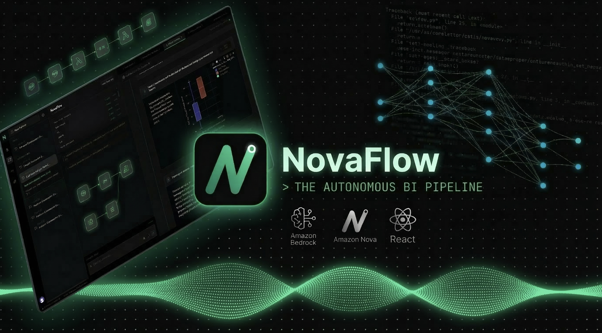
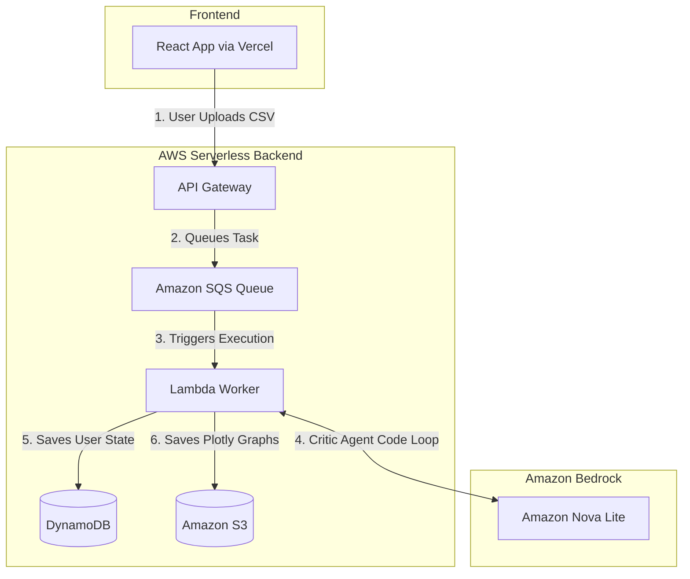

<div align="center">
  
  
  # NovaFlow: The Autonomous BI Pipeline
  <div align="center">
  
  </div>  
  <br />

  **Built for the Amazon Nova Hackathon 2026**
<div align="center">

  <a href="https://nova-flow-bi.vercel.app">
    
  </a>
  
  <a href="https://youtu.be/85TeXfFqq9U">
    
  </a>
  
  <a href="https://builder.aws.com/content/3AwnEbeyzEM3ZUpDGGctUhDKfLn/automating-ad-hoc-analytics-building-a-self-correcting-data-agent-with-amazon-nova">
    
  </a>

</div>
<br/>

  [](#)
  [](#)
  [](#)
  [](#)
</div>

<br/>

NovaFlow is a fully autonomous, 100% serverless Business Intelligence pipeline. Instead of relying on static AI chatbots, NovaFlow uses a self-healing **Amazon Nova Lite** Critic Agent to autonomously profile raw CSV datasets, write dynamic SQL, generate interactive Plotly dashboards, and synthesize broadcast-quality neural audio briefs using **Amazon Nova Sonic**.

Data pipelines shouldn't hold business intelligence hostage. With NovaFlow, you just upload your data, ask your question, and listen to the AI brief you on the results.

---

Let's be honest about the state of Business Intelligence: the traditional data pipeline is fundamentally broken. A business leader asks a question, a ticket is filed, an analyst writes the SQL, and weeks later, a static dashboard is delivered. By the time the data is ready, the question has changed.

NovaFlow is an experiment in collapsing that entire timeline into seconds.

It is a 100% serverless, zero-idle autonomous agent that ingests raw CSV datasets, writes and executes its own dynamic SQL, auto-corrects its own traceback errors, and synthesizes broadcast-quality audio briefs using Amazon Bedrock.

No persistent databases to manage. No idle compute costs. Just an ephemeral, self-healing sandbox driven by the Amazon Nova model family.

### Why NovaFlow?
1. **Zero-Idle Infrastructure**: If no one is querying the system, the AWS bill should be $0.00. The entire pipeline is built on AWS Lambda, API Gateway, and SQS.
2. **Data Incineration**: Enterprise data shouldn't sit in forgotten buckets. Raw uploads are placed in ephemeral S3 storage with strict 24-hour lifecycle incineration policies.
3. **Self-Healing Execution**: LLMs are notoriously bad at writing perfect SQL on the first try. Instead of failing, our Critic Agent intercepts execution tracebacks in an isolated SQLite memory space, rewrites the query, and tries again. The user never sees the retry loop.
4. **Multimodal Output**: Dashboards require active reading. Executives are busy. We bypass the React virtual DOM to stream natively generated audio briefs (via Amazon Nova Sonic) directly to the client.

---

## Architecture: How it actually works?

Building an autonomous agent that executes code on raw user data presents two massive headaches: API timeouts and security. If you just wire an LLM directly to a database, you get dropped connections and SQL injections. We decoupled the entire stack to solve this.



### 1. Beating the API Gateway Timeout (SQS Decoupling)

AWS API Gateway has a hard 29-second timeout limit. You can't run a synchronous LLM call, profile a 50,000-row CSV, and generate audio in under 29 seconds consistently. So I ripped out the synchronous response.

The API Gateway acts strictly as a bouncer. It validates the Clerk JWT, checks the DynamoDB quota limits, generates a pre-signed S3 URL for the client to upload their file, and tosses the job payload into an SQS queue. It immediately returns a `202 Accepted`, and the React frontend takes over with async polling.

### 2. The Ephemeral Sandbox

Letting an AI write and execute dynamic SQL based on user input is usually a terrible idea. To isolate the execution, we do not use a persistent database for analysis.

When SQS triggers the Worker Lambda, it pulls the raw CSV from S3 and mounts it directly into an in-memory SQLite instance (`:memory:`). The AI queries this isolated memory space. The second the Lambda container spins down, the database ceases to exist. There is zero risk of a prompt-injected `DROP TABLE` command destroying anything permanently.

### 3. The Critic Loop (Self-Healing Code)

LLMs hallucinate. Even the good ones will eventually mess up a JOIN or invent a column name that doesn't exist.

Instead of passing a 500 error back to the UI when the SQL fails, we built a self-healing loop. If the `sqlite3` engine throws a Python traceback error, the Lambda catches it. It feeds that exact traceback right back to Nova Lite as a "Critic" prompt, forcing the model to rewrite the broken SQL. It loops this until the query executes cleanly. The user never sees the retry process, they just get the right answer.

### 4. State Management & Audio Streaming

Once the data is aggregated and the Plotly JSON is structured, the Worker Lambda makes a final pass through Amazon Nova Sonic to generate the neural audio brief. Everything gets serialized and dumped into DynamoDB. The frontend, which has been polling the `check_status` endpoint, detects the state change, kills the loading terminal, and mounts the final dashboard to the DOM.

---

## The Stack

* **Frontend**: React 19, Vite 6, Tailwind CSS v4, Plotly.js (for the heavy data visualization).
* **Auth**: Clerk (because building auth from scratch during a hackathon is a trap).
* **Backend**: AWS API Gateway, Amazon SQS, AWS Lambda (Python 3.10), DynamoDB, Amazon S3.
* **AI Models**: Amazon Bedrock (Nova Lite v1.0 for routing and SQL, Nova Sonic v1.0 for the audio engine).

## Spin it up locally

If you want to run this on your own machine, you'll need an AWS environment, a Clerk project, and Node installed.

### 1. The Backend (AWS)

You will need to deploy the two Python scripts (`gatekeeper/lambda_function.py` and `nova_worker/lambda_function.py`) to AWS Lambda.

* **Warning:** You must give the Worker Lambda at least 1024MB of RAM and a 3-minute timeout. If you leave it at the default 128MB, Pandas and SQLite will cause an Out-Of-Memory (OOM) crash instantly.
* Wire up API Gateway to the Gatekeeper Lambda, and set the SQS queue as the trigger for the Worker Lambda.

### 2. The Frontend (React)

Clone the repo and drop into the frontend folder:

```bash
git clone https://github.com/NemesisWaVe/NovaFlow.git
cd NovaFlow/frontend

```

**Crucial install note:** We are bleeding-edge here using React 19 and Vite 6. There is currently a known upstream peer dependency conflict between the Vite plugins and Clerk's React SDK. You *must* use the legacy peer deps flag or npm will refuse to build.

```bash
npm install --legacy-peer-deps

```

Create a `.env` file in the `frontend` directory with your gateway and auth keys:

```env
VITE_AWS_API_URL="your-api-gateway-url"
VITE_CLERK_PUBLISHABLE_KEY="your-clerk-key"
VITE_ADMIN_EMAIL="your-email@domain.com"

```

Boot the local dev server:

```bash
npm run dev

```
---
